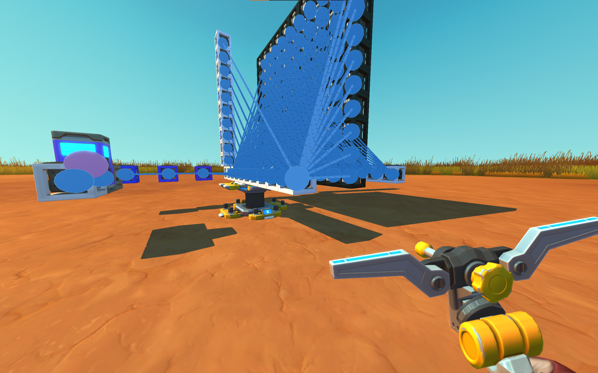
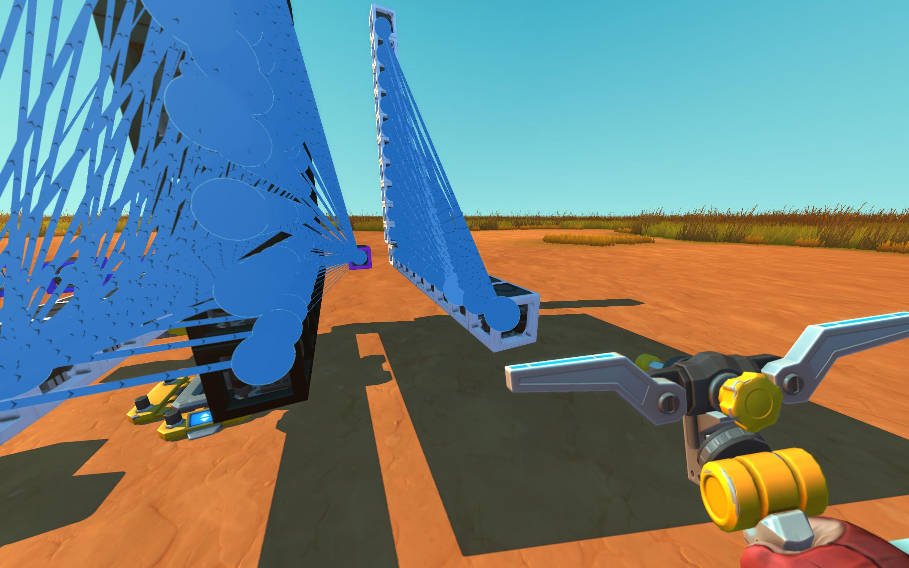

# sm_blueprint_lib - Scrap Mechanic Blueprint Library

**sm_blueprint_lib** is a comprehensive Python library for programmatically creating and manipulating Scrap Mechanic blueprints. Build complex logic circuits, automated systems, and mechanical constructions using Python code instead of manual in-game placement.

## 🚀 Features

- **Programmatic Blueprint Creation**: Transform Python code into Scrap Mechanic-compatible blueprint files
- **Complex Logic Systems**: Build circuits that would be impractical to create manually
- **Precise Positioning**: Exact coordinate control for all parts and blocks
- **Flexible Connections**: Support for 1-to-1, 1-to-many, many-to-1, and many-to-many wire connections
- **Pre-built Components**: Ready-to-use logic circuits (adders, counters, memory, etc.)
- **3D Preview System**: Visualize your blueprints before importing to the game
- **High Performance**: Optimized for large-scale constructions with thousands of parts

## 📦 Installation

```bash
pip install sm_blueprint_lib
```

Update to the latest version:
```bash
pip install --upgrade sm_blueprint_lib
```

## 🛠️ Quick Start

### Basic Blueprint Creation

```python
import sm_blueprint_lib as sm

# Create a Blueprint object
bp = sm.Blueprint()

# Create a logic gate at position (0,0,0) with blue color
gate = sm.LogicGate(pos=(0, 0, 0), color="1122ff", controller=0)

# Add to blueprint
bp.add(gate)

# Save to file
sm.save_blueprint("my_blueprint", bp)
```

### Advanced Example

```python
import numpy as np
import sm_blueprint_lib as sm

# Create blueprint
bp = sm.Blueprint()

# Create logic gates with different controller modes
single_and = sm.LogicGate(pos=(0, 0, 0), color="1122ff", controller=0)  # AND gate
single_or = sm.LogicGate(sm.Pos(0, 2, 0), sm.PAINT_COLOR.Blue, 1)     # OR gate

# Controller modes: 0=and, 1=or, 2=xor, 3=nand, 4=nor, 5=xnor
# Or use strings: "and", "or", "xor", "nand", "nor", "xnor"

# Create multiple gates efficiently
row_0 = [sm.LogicGate((x, 6, 0), "ffffff", "and") for x in range(10)]
row_1 = [sm.LogicGate((-1, 6, z + 1), "ffffff", 0) for z in range(10)]

# Create a 10x10 logic gate matrix using numpy
matrix = np.ndarray((10, 10), dtype=sm.LogicGate)
for x in range(10):
    for z in range(10):
        matrix[x, z] = sm.LogicGate(
            (x, 8, z + 1), "000000", 5, xaxis=1, zaxis=2)  # XNOR gate with rotation

# Timer circuit for automated systems
timer_loop = [
    sm.LogicGate((4, 0, 0), "987654"),
    sm.Timer((5, 0, 0), "3210ff", (1, 0)),  # 1-second timer
    sm.LogicGate((6, 0, 0), "eeddcc", 3)
]

# Connect components
sm.connect(single_and, single_or)                    # 1-to-1
sm.connect(row_0, row_1)                            # Row-to-row (parallel)
sm.connect(single_or, row_0)                         # 1-to-many
sm.connect(matrix, single_and)                      # Many-to-1
sm.connect(row_0, row_1, parallel=False)            # Many-to-many (everything to everything)

# Chain connections
timer_loop[0].connect(timer_loop[1]).connect(timer_loop[2]).connect(timer_loop[0])

# Add all parts to blueprint
bp.add(single_and, single_or, row_0, row_1, matrix, timer_loop)

# Export blueprint
print(sm.dump_string_from_blueprint(bp))
sm.save_blueprint("advanced_blueprint", bp)
```

## 🎨 Color System

```python
# Multiple color formats supported
gate1 = sm.LogicGate((0,0,0), "1122ff", 0)           # Hex string
gate2 = sm.LogicGate((0,1,0), (17, 34, 255), 0)      # RGB tuple
gate3 = sm.LogicGate((0,2,0), sm.PAINT_COLOR.Yellow, 0)  # Paint gun colors
gate4 = sm.LogicGate((0,3,0), sm.PAINT_COLOR.Barberry, 0) # Named colors
```

## 🔌 Connection Patterns

The `connect()` function supports multiple connection patterns:

```python
# 1-to-1 connection
sm.connect(gate1, gate2)

# 1-to-many connection
sm.connect(input_gate, [output1, output2, output3])

# Many-to-1 connection
sm.connect([input1, input2, input3], output_gate)

# Row-to-row (parallel connections)
sm.connect(row_a, row_b)  # parallel=True by default

# Many-to-many (everything connects to everything)
sm.connect(row_a, row_b, parallel=False)

# Chain connections
gate1.connect(gate2).connect(gate3)
```

## 🏗️ Pre-built Components

Library includes pre-built logic circuits for common operations:

```python
# Memory systems
ram_module = sm.ram(bp, bit_length=8, num_address=16)
rom_module = sm.rom(bp, bit_length=8, num_address=16)

# Logic circuits
adder_8bit = sm.adder(bp, 8)
counter_4bit = sm.counter(bp, 4)
decoder_3to8 = sm.decoder(bp, 3, 8)

# Timing systems
clock_40hz = sm.clock40hz(bp)
timer_circuit = sm.timer_ram_cached(bp, 8, 16)
```

## 👁️ 3D Preview

Visualize your blueprints in real-time:

```python
# Preview your blueprint with 3D rendering
sm.preview(bp)
```

Features:
- Real-time camera controls (WASD + mouse)
- Accurate game asset rendering
- Interactive exploration
- Performance optimized with lazy loading

## 📁 File Operations

```python
# Load existing blueprint
bp = sm.load_blueprint("path/to/blueprint.json")

# Save to file
sm.save_blueprint("my_blueprint", bp)

# Export as JSON string
json_string = sm.dump_string_from_blueprint(bp)

# Load from JSON string
bp = sm.load_blueprint_from_string(json_string)
```

## 🧮 Positioning & Rotation

```python
# Flexible position input
gate1 = sm.LogicGate((x, y, z), color, controller)     # Tuple
gate2 = sm.LogicGate(sm.Pos(x, y, z), color, controller)  # Pos object

# Custom rotation
gate = sm.LogicGate((x, y, z), "ffffff", 0, xaxis=1, zaxis=2)

# Rotation helper
gate.rotate(ROTATION.FACING.NORTH, ROTATION.ROTATED.DEG_90)
```

## ⚡ Performance Features

The library is optimized for large-scale constructions:

- **Iterative Processing**: No recursion limits for complex blueprints
- **Efficient Connections**: Optimized algorithms for many-to-many wiring
- **Memory Management**: Reduced memory footprint for large projects
- **Lazy Loading**: Preview system loads resources on-demand
- **Cached Operations**: Path discovery and other expensive operations are cached

## 🎯 Use Cases

### Logic Circuit Design
Create complex logic systems without manual placement:
```python
# 10x10 logic gate matrix
matrix = np.ndarray((10, 10), dtype=sm.LogicGate)
for x in range(10):
    for z in range(10):
        matrix[x, z] = sm.LogicGate((x, 8, z + 1), "000000", 5)
```

### Automated Systems
Build timers, sensors, and control systems:
```python
# Automated timer loop
automation = [
    sm.LogicGate((4, 0, 0), "987654"),
    sm.Timer((5, 0, 0), "3210ff", (1, 0)),  # 1 second
    sm.LogicGate((6, 0, 0), "eeddcc", 3)
]
```

### Large-Scale Constructions
Create massive structures programmatically:
```python
# Generate hundreds of components
rows = [sm.LogicGate((x, y, 0), "ffffff", "and") for x in range(100)]
```

## 🔧 Dependencies

- **numpy**: Array operations and mathematical functions
- **pygame**: Window management and input for preview system
- **moderngl**: OpenGL rendering for 3D visualization
- **pyglm**: 3D mathematics and transformations
- **PyWavefront**: 3D model loading for game assets

## 📖 Why Use sm_blueprint_lib?

1. **Precision**: Exact positioning and configuration of parts
2. **Scalability**: Create hundreds or thousands of parts automatically
3. **Complexity**: Build logic circuits that would be impractical manually
4. **Reproducibility**: Save and share designs as code
5. **Integration**: Combine with Python data processing and algorithms
6. **Visualization**: Preview designs before importing to the game

## 📚 Examples

### Results

#### 1 to 1 and loop


#### Row to row and 1 to many


#### Many to 1 and many to many


## 🤝 Contributing

Contributions are welcome! Please feel free to submit a Pull Request.

## 📄 License

This project is licensed under the MIT License - see the LICENSE file for details.

## 🔗 Links

- **GitHub**: https://github.com/MauriceTZ/sm_blueprint_lib
- **Issues**: https://github.com/MauriceTZ/sm_blueprint_lib/issues
- **PyPI**: https://pypi.org/project/sm-blueprint-lib/
